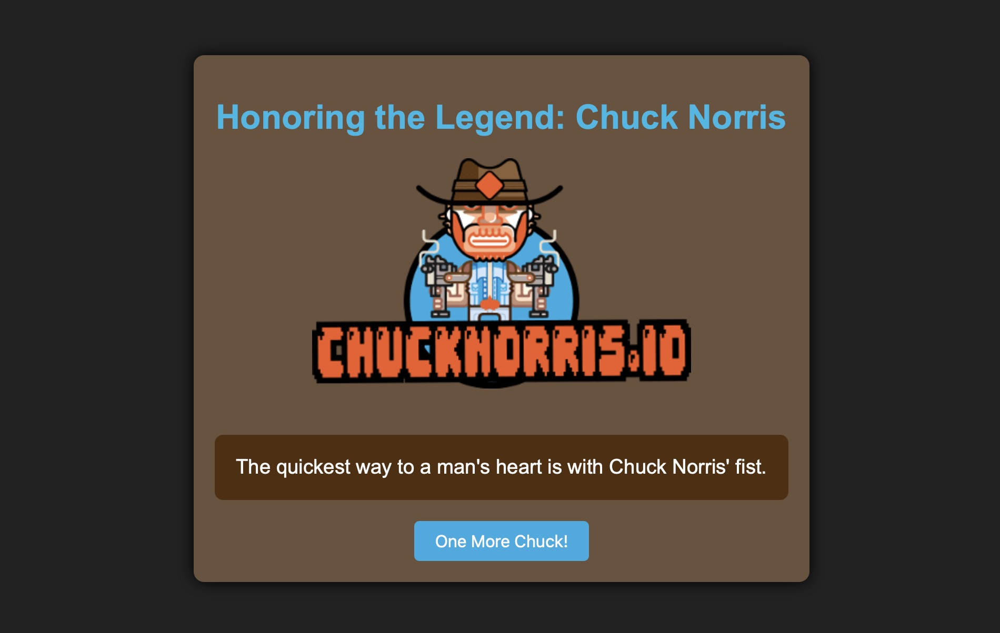

# 🥋 Chuck Norris Joke Generator

This is a simple web application built with **HTML**, **CSS**, and **JavaScript** (no frameworks) that displays random Chuck Norris jokes using the [Chuck Norris Joke API](https://api.chucknorris.io/).

## 🎯 Features

- Fetches a new Chuck Norris joke each time the page is loaded or a button is clicked.
- Includes a Chuck Norris image.
- Styled with pure HTML & CSS (no Bootstrap or external stylesheets).
- Fully responsive and mobile-friendly.

## 🛠️ Technologies Used

- HTML5
- CSS3 (internal style tag)
- JavaScript (ES6+)
- [Chuck Norris Joke API](https://api.chucknorris.io/)

## 🖼️ Screenshot

## 📄 License

This project is open source and available under the MIT License.
